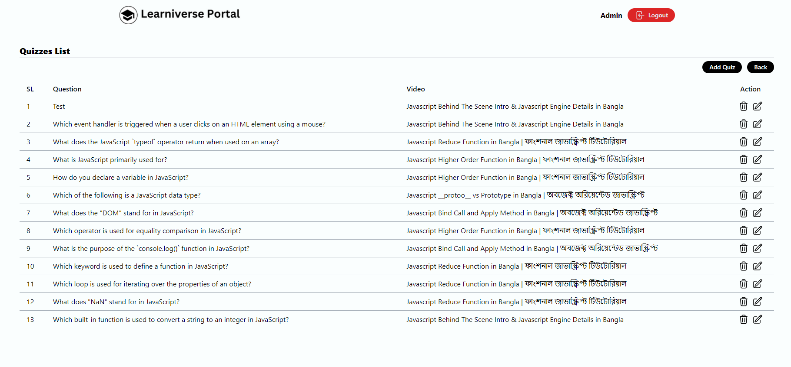
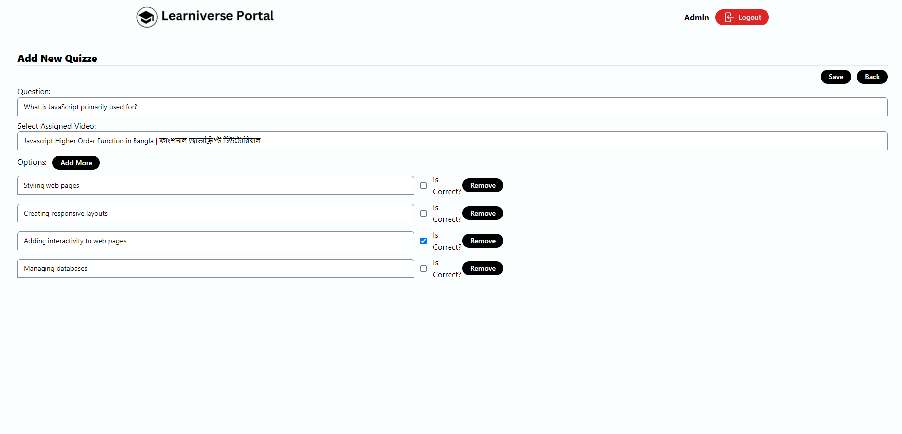
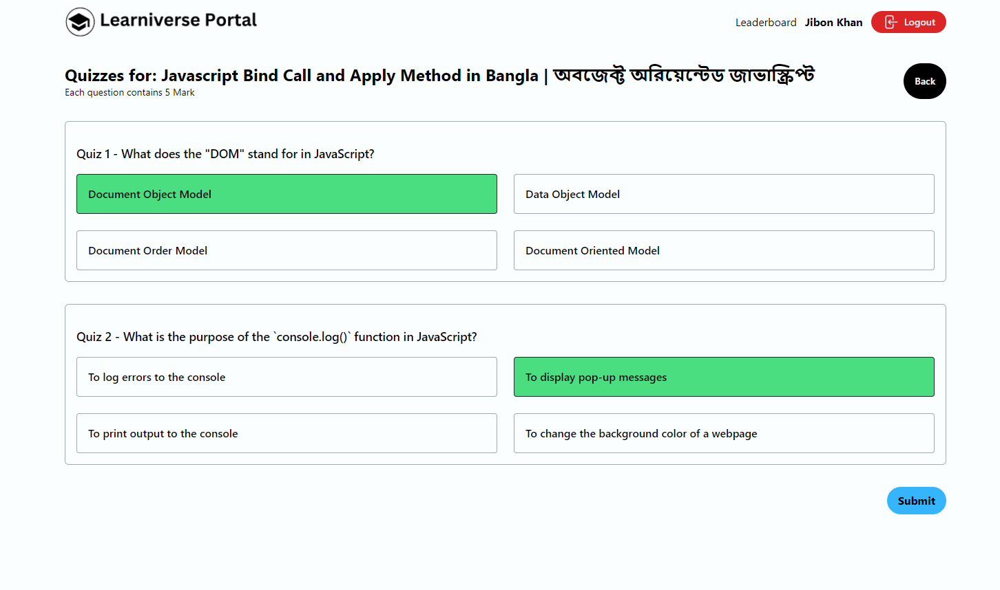
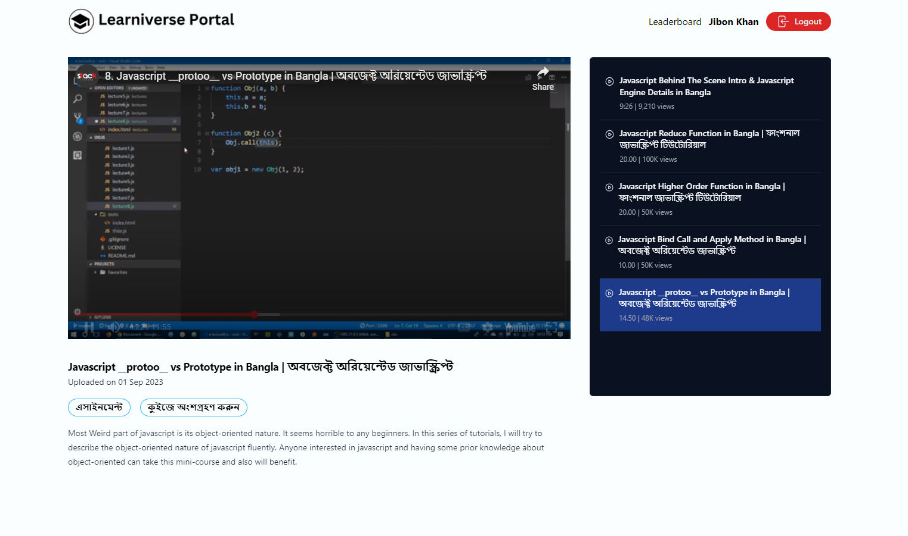

### Introducing our innovative Online Learniverse Portal a dynamic platform designed to transform education. Tailored for both Students and Admins as a tutor, this solution offers interactive learning experiences, seamless content management. From video-based lessons and quizzes to assignment submissions and leaderboards.

- Programming Language: Javascript, TypeScript 
- Run Time: Node.js
- Database: MongoDB (NoSQL Database) 

- Front-end Development: React.js, HTML, CSS, Axios,
- Back-end Development: TypeScript, Express.js, Mongoose, 
- Development Tools: Visual Studio Code, Github, Compass as Database GUI 

Some Screenshot are provided.
## 1. Home Page (Admin) 

## 2. Quizzes (admin)

## 3. Add Quize (admin)

## 4. Participate Quize (Student)

## 5. Watch Videos (Student)
